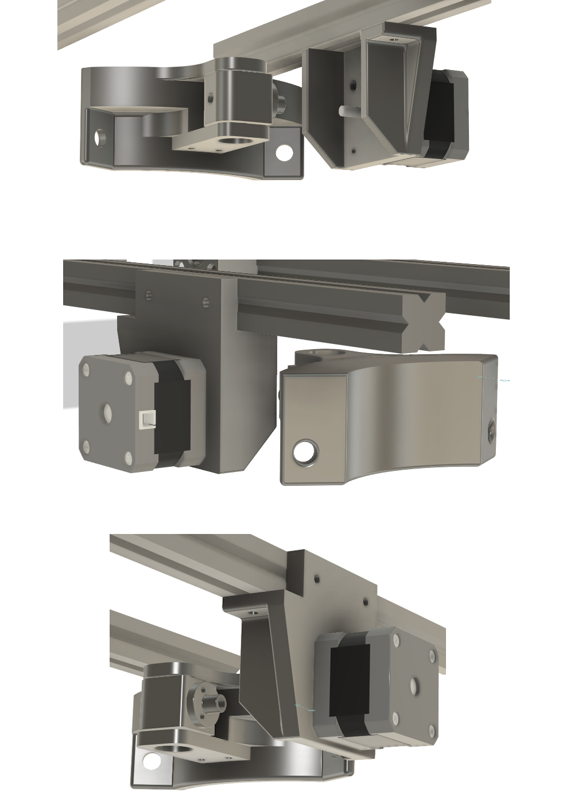

# Alternative AZ motor setup

## Parts
* 5x M3 screws and the nuts that you melt into the PLA (forgot what they are called)
* 4x M3 screws to hold the stepper
* 2x sets of M4 screws and T-nuts to mount motor holder to OAM.
* 2x screws and nuts to attach to EQ5 legs (these are already on the EQ5)
* 1x 100mm lead screw and nut [Amazon](https://www.amazon.com/gp/product/B081VN8QRM/ref=ppx_yo_dt_b_asin_title_o02_s02?ie=UTF8&th=1)
* 1x 5mm coupler. I used [this one](https://www.amazon.com/gp/product/B07GMW7T2D/ref=ppx_yo_dt_b_asin_title_o02_s04?ie=UTF8&psc=1), but you might be able to use other flexible couplers
* 4x 6000Z bearings [Amazon](https://www.amazon.com/gp/product/B07DS4FVDJ/ref=ppx_yo_dt_b_asin_title_o03_s00?ie=UTF8&psc=1)
* 2x 10mm length 5mm rod (cut from this one from [Amazon](https://www.amazon.com/gp/product/B09NM8F911/ref=ppx_yo_dt_b_asin_title_o05_s00?ie=UTF8&psc=1))
* 1x Teflon sheet [Amazon](https://www.amazon.com/gp/product/B0195H6JTY/ref=ppx_yo_dt_b_asin_title_o01_s00?ie=UTF8&psc=1). You'll cut two rings from this.
* Synthetic grease to lubricate between the two Teflon rings
 

